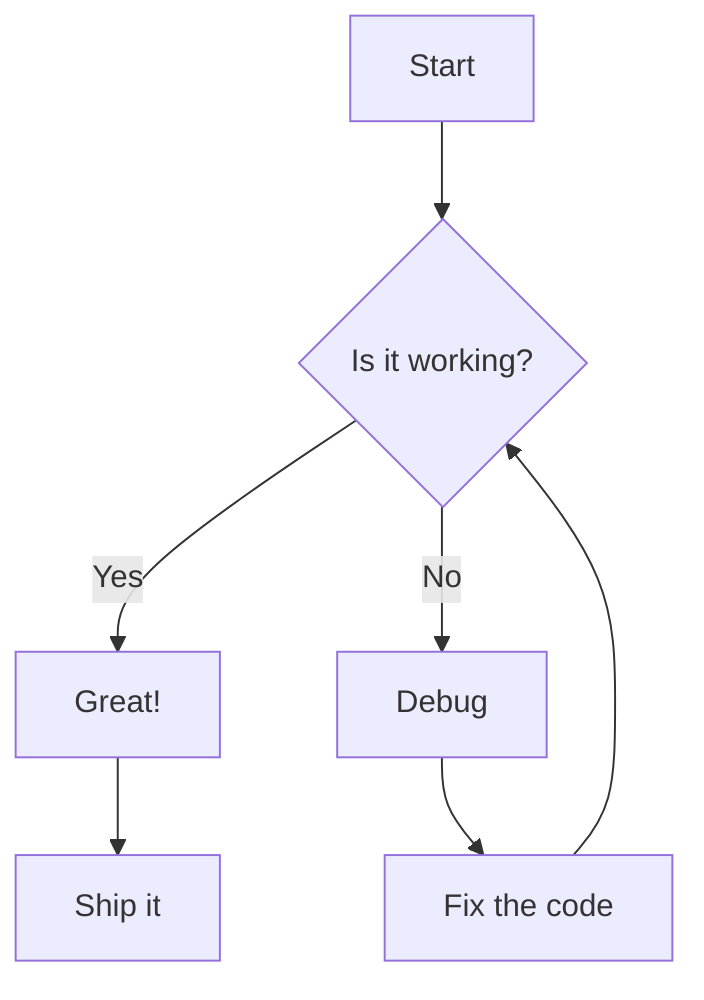
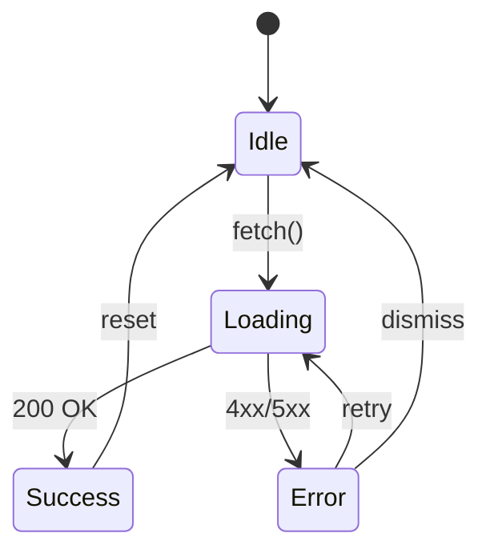
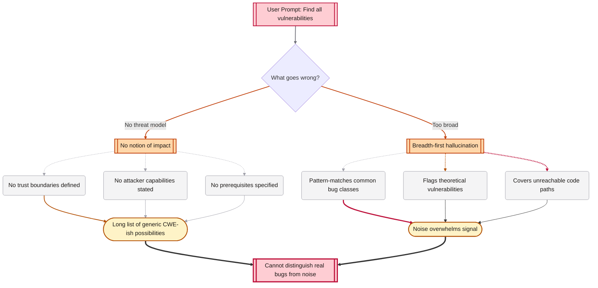

# Feature Test Document

This is the introduction paragraph that should have a drop cap on the first letter. It demonstrates the editorial styling with justified text, automatic hyphenation, and the warm parchment aesthetic. Lorem ipsum dolor sit amet, consectetur adipiscing elit.

## Typography and Fonts

All headings (h2, h3, h4) should render in **Iosevka** font. Body text uses Source Serif 4. The main title above should also be Iosevka and non-italic.

### Subheading Level 3

This is an h3 subheading, also in Iosevka. It should be visually distinct from h2 but still monospaced.

#### Subheading Level 4

This is an h4 subheading, uppercase and in Iosevka.

Regular body text continues here in the serif font. **Bold text** and *italic text* and ***bold italic*** should all work. Here is some `inline code in Iosevka` within a sentence.

---

## Table of Contents Navigation

This section tests TOC navigation. Click any item in the sidebar to scroll directly here. The TOC should use the old serif font (Source Serif 4), while content headings use Iosevka.

Each section should be framed with crosshair-style accents at the top-left and bottom-right corners.

Lorem ipsum dolor sit amet, consectetur adipiscing elit. Sed do eiusmod tempor incididunt ut labore et dolore magna aliqua. Ut enim ad minim veniam, quis nostrud exercitation ullamco laboris nisi ut aliquip ex ea commodo consequat. Duis aute irure dolor in reprehenderit in voluptate velit esse cillum dolore eu fugiat nulla pariatur.

Lorem ipsum dolor sit amet, consectetur adipiscing elit. Sed do eiusmod tempor incididunt ut labore et dolore magna aliqua. Ut enim ad minim veniam, quis nostrud exercitation ullamco laboris nisi ut aliquip ex ea commodo consequat.

## Code Blocks and Syntax Highlighting

### Python

```python
def fibonacci(n):
    """Generate the first n Fibonacci numbers."""
    a, b = 0, 1
    result = []
    for _ in range(n):
        result.append(a)
        a, b = b, a + b
    return result

if __name__ == "__main__":
    print(fibonacci(10))
```

### JavaScript

```javascript
class EventEmitter {
  constructor() {
    this.listeners = new Map();
  }

  on(event, callback) {
    if (!this.listeners.has(event)) {
      this.listeners.set(event, []);
    }
    this.listeners.get(event).push(callback);
    return this;
  }

  emit(event, ...args) {
    const callbacks = this.listeners.get(event) || [];
    callbacks.forEach(cb => cb(...args));
  }
}

const emitter = new EventEmitter();
emitter.on('data', (msg) => console.log(`Received: ${msg}`));
emitter.emit('data', 'Hello World');
```

### Rust

```rust
use std::collections::HashMap;

fn word_count(text: &str) -> HashMap<&str, usize> {
    let mut counts = HashMap::new();
    for word in text.split_whitespace() {
        *counts.entry(word).or_insert(0) += 1;
    }
    counts
}

fn main() {
    let text = "the quick brown fox jumps over the lazy dog the fox";
    let counts = word_count(text);
    for (word, count) in &counts {
        println!("{}: {}", word, count);
    }
}
```

### Bash

```bash
#!/bin/bash
for file in *.log; do
    line_count=$(wc -l < "$file")
    echo "$file: $line_count lines"
done | sort -t: -k2 -rn | head -5
```

Each code block above should have:
- A language label in the top-right corner
- A **Copy** button that appears on hover (bottom-right)
- Syntax highlighting with proper colors

## Math Formulas

### Inline Math

Einstein's famous equation is $E = mc^2$. The quadratic formula gives $x = \frac{-b \pm \sqrt{b^2 - 4ac}}{2a}$ for any quadratic $ax^2 + bx + c = 0$.

Euler's identity: $e^{i\pi} + 1 = 0$.

### Display Math

The Gaussian integral:

$$\int_{-\infty}^{\infty} e^{-x^2} \, dx = \sqrt{\pi}$$

Maxwell's equations in differential form:

$$\nabla \cdot \mathbf{E} = \frac{\rho}{\varepsilon_0}$$

$$\nabla \cdot \mathbf{B} = 0$$

$$\nabla \times \mathbf{E} = -\frac{\partial \mathbf{B}}{\partial t}$$

$$\nabla \times \mathbf{B} = \mu_0 \mathbf{J} + \mu_0 \varepsilon_0 \frac{\partial \mathbf{E}}{\partial t}$$

The Fourier transform:

$$\hat{f}(\xi) = \int_{-\infty}^{\infty} f(x) \, e^{-2\pi i x \xi} \, dx$$

### LaTeX Delimiters

Using backslash-paren for inline: \(a^2 + b^2 = c^2\)

Using backslash-bracket for display:

\[\sum_{n=1}^{\infty} \frac{1}{n^2} = \frac{\pi^2}{6}\]

## Mermaid Diagrams

### Flowchart



### Sequence Diagram

```mermaid
sequenceDiagram
    participant U as User
    participant C as Client
    participant S as Server
    participant DB as Database

    U->>C: Click button
    C->>S: API Request
    S->>DB: Query
    DB-->>S: Results
    S-->>C: JSON Response
    C-->>U: Update UI
```



### State Diagram



### Complex mermaid




## Images

### Linked Image (clickable to open full size)


### Second Image


## Tables

| Feature | Status | Notes |
|---------|--------|-------|
| TOC Navigation | Working | Click to scroll, active tracking |
| Syntax Highlighting | Working | hljs with language labels |
| Copy Code Button | Working | Appears on hover |
| Math (KaTeX) | Working | Inline and display modes |
| Mermaid Diagrams | Working | Flowchart, sequence, state |
| Image Links | Working | Click to open full size |
| Theme Toggle | Working | Light / Dark (Solarized) / Sepia |
| Zen Mode | Working | Distraction-free reading |
| Crosshair Accents | Working | Top-left and bottom-right |
| Drop Cap | Working | First paragraph only |
| Hover Preview | Working | Scrollable, full section content |
| Text Selection | Working | Red background highlight |

## Blockquotes

> "The best way to predict the future is to invent it."
> -- Alan Kay

> **Note:** This is a blockquote with **bold** and `code` inside it. The drop cap should NOT appear here since it's inside a blockquote.

> Nested content in blockquotes:
> - Item one
> - Item two
> - Item three

## Lists

### Unordered List

- First item with some longer text that might wrap to the next line to test justified alignment
- Second item
  - Nested item A
  - Nested item B
- Third item

### Ordered List

1. Parse the markdown input
2. Extract math expressions before processing
3. Run through marked.js parser
4. Restore math expressions
5. Inject heading IDs via regex
6. Insert into DOM
7. Apply syntax highlighting, mermaid, KaTeX

## Links

- [External link to GitHub](https://github.com) should open in a new tab
- [Another external link](https://example.com) with target blank

## Theme Toggle and Zen Mode

Use the buttons in the top-right corner:
- **Moon/Sun/Book icon**: Cycles through Light, Dark (Solarized), and Sepia themes
- **Expand icon**: Toggles Zen mode for distraction-free reading (press Escape to exit)

The theme preference is saved in localStorage and persists across reloads.

## Text Selection Test

Try selecting any text on this page. The selection highlight should appear with a **red background**.

Lorem ipsum dolor sit amet, consectetur adipiscing elit. Sed do eiusmod tempor incididunt ut labore et dolore magna aliqua. Select this text to verify the red highlight.

## Horizontal Rules

Above and below this section are horizontal rules (thin centered lines).

---

## Final Section

This is the last section. The closing ornament symbol should appear below. Each section above should be wrapped with crosshair accents — thin perpendicular lines at top-left and bottom-right.

Scrolling back to the top via the TOC should work smoothly. The active TOC item should highlight as you scroll through the document.
